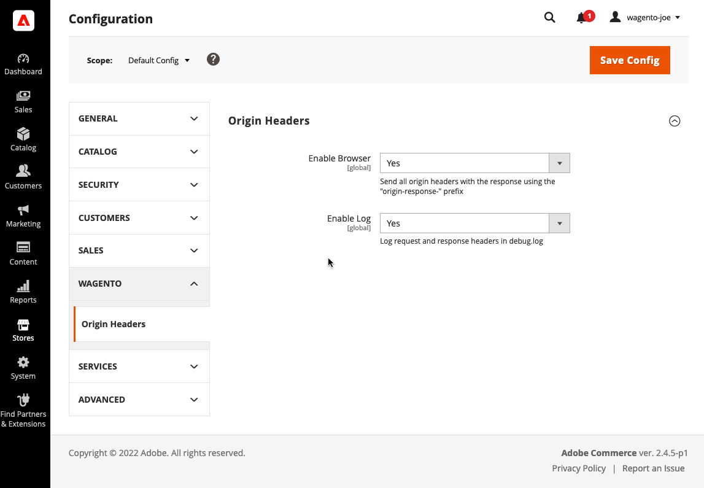

# Wagento Log Origin Headers

## Summary

This module will optionally log the HTTP response headers sent by the origin. Two options for logging: either in the response itself or in Magento's debug.log. This module is most helpful in troubleshooting issues on projects where the Magento application is behind Varnish or other reverse proxies known to alter HTTP headers.

## Installation

Available on Packagist!

```
composer require wagento/module-origin-headers
```

## Configuration



## Examples

### debug.log

```
[2022-11-09T17:40:13.667115+00:00] report.DEBUG:
Request headers:
GET https://sample.test/pursuit-lumaflex-trade-tone-band.html HTTP/1.1
Cookie: private_content_version=e1c9eb8a978af314a7d8f6764747b0c1; AMCV_8F99160E571FC0427F000101%40AdobeOrg=-1124106680%7CMCIDTS%7C19305%7CMCMID%7C11742703665624108363382070205390771849%7CMCAAMLH-1668478212%7C7%7CMCAAMB-1668478212%7C6G1ynYcLPuiQxYZrsz_pkqfLG9yMXBpb2zX5dvJdYQJzPXImdj0y%7CMCOPTOUT-1667880612s%7CNONE%7CMCSYNCSOP%7C411-19312%7CvVersion%7C5.2.0; apt_uid=AP-XD7ZED5OKDHG-2-1-1667873413453-99578985.0.2.fbadc1f5-6f2e-4fb3-9ad7-5c7ce74c4532; form_key=yendLC64E3SBjrja; mage-banners-cache-storage=%7B%7D; mage-cache-storage=%7B%7D; mage-cache-storage-section-invalidation=%7B%7D; mage-cache-sessid=true; mage-messages=; recently_viewed_product=%7B%7D; recently_viewed_product_previous=%7B%7D; recently_compared_product=%7B%7D; recently_compared_product_previous=%7B%7D; product_data_storage=%7B%7D; PHPSESSID=dbce1e1d4976069e8b10bbe18a4fbc2b
X-Varnish: 196779
Accept-Encoding: gzip
X-Forwarded-For: 192.168.160.1
Pragma: no-cache
Sec-Fetch-User: ?1
Sec-Fetch-Site: same-origin
Sec-Fetch-Mode: navigate
Sec-Fetch-Dest: document
Upgrade-Insecure-Requests: 1
Referer: https://sample.test/gear/fitness-equipment.html
Accept-Language: en-US, en;q=0.5
Accept: text/html, application/xhtml+xml, application/xml;q=0.9, image/avif, image/webp, */*;q=0.8
User-Agent: Mozilla/5.0 (Macintosh; Intel Mac OS X 10.15; rv:107.0) Gecko/20100101 Firefox/107.0
X-Forwarded-Proto: https
X-Real-Ip: 192.168.160.1
Host: sample.test

 
Response headers:
fastly-page-cacheable: YES
Pragma: cache
Cache-Control: max-age=86400, public, s-maxage=86400
Expires: Thu, 10 Nov 2022 17:40:08 GMT
X-Magento-Tags: store,cms_b,cms_b_2,cms_b_footer_links_block,cat_p_18,cat_p,cat_p_16,cat_p_21,cat_p_15,cat_p_1,cat_p_2,cat_p_19,cat_p_17,cat_c_p_5,review_block
X-Magento-Debug: 1
Content-Security-Policy-Report-Only: font-src data: 'self' 'unsafe-inline'; form-action geostag.cardinalcommerce.com geo.cardinalcommerce.com 1eafstag.cardinalcommerce.com 1eaf.cardinalcommerce.com centinelapistag.cardinalcommerce.com centinelapi.cardinalcommerce.com pilot-payflowlink.paypal.com www.paypal.com www.sandbox.paypal.com *.cardinalcommerce.com *.paypal.com 'self' 'unsafe-inline'; frame-ancestors 'self'; frame-src fast.amc.demdex.net *.adobe.com geostag.cardinalcommerce.com geo.cardinalcommerce.com 1eafstag.cardinalcommerce.com 1eaf.cardinalcommerce.com centinelapistag.cardinalcommerce.com centinelapi.cardinalcommerce.com bid.g.doubleclick.net www.googletagmanager.com *.youtube.com *.youtube-nocookie.com www.paypal.com www.sandbox.paypal.com pilot-payflowlink.paypal.com player.vimeo.com https://www.google.com/recaptcha/ c.paypal.com checkout.paypal.com assets.braintreegateway.com pay.google.com *.cardinalcommerce.com *.paypal.com 'self' 'unsafe-inline'; img-src assets.adobedtm.com amcglobal.sc.omtrdc.net dpm.demdex.net cm.everesttech.net *.adobe.com widgets.magentocommerce.com data: www.googleadservices.com www.google-analytics.com googleads.g.doubleclick.net www.google.com bid.g.doubleclick.net analytics.google.com www.googletagmanager.com *.ftcdn.net *.behance.net t.paypal.com www.paypal.com www.paypalobjects.com fpdbs.paypal.com fpdbs.sandbox.paypal.com *.vimeocdn.com i.ytimg.com *.youtube.com validator.swagger.io www.sandbox.paypal.com b.stats.paypal.com dub.stats.paypal.com assets.braintreegateway.com c.paypal.com checkout.paypal.com *.paypal.com data: 'self' 'unsafe-inline'; script-src assets.adobedtm.com *.adobe.com geostag.cardinalcommerce.com 1eafstag.cardinalcommerce.com geoapi.cardinalcommerce.com 1eafapi.cardinalcommerce.com songbird.cardinalcommerce.com includestest.ccdc02.com www.googleadservices.com www.google-analytics.com googleads.g.doubleclick.net analytics.google.com www.googletagmanager.com www.paypal.com www.sandbox.paypal.com www.paypalobjects.com t.paypal.com s.ytimg.com www.googleapis.com vimeo.com www.vimeo.com *.vimeocdn.com *.youtube.com https://www.gstatic.com/recaptcha/ https://www.google.com/recaptcha/ js.braintreegateway.com assets.braintreegateway.com c.paypal.com pay.google.com api.braintreegateway.com api.sandbox.braintreegateway.com client-analytics.braintreegateway.com client-analytics.sandbox.braintreegateway.com *.paypal.com 'self' 'unsafe-inline' 'unsafe-eval'; style-src *.adobe.com unsafe-inline 'self' 'unsafe-inline'; object-src 'self' 'unsafe-inline'; media-src *.adobe.com 'self' 'unsafe-inline'; manifest-src 'self' 'unsafe-inline'; connect-src dpm.demdex.net amcglobal.sc.omtrdc.net geostag.cardinalcommerce.com geo.cardinalcommerce.com 1eafstag.cardinalcommerce.com 1eaf.cardinalcommerce.com centinelapistag.cardinalcommerce.com centinelapi.cardinalcommerce.com www.google-analytics.com www.googleadservices.com analytics.google.com www.googletagmanager.com vimeo.com www.sandbox.paypal.com www.paypalobjects.com www.paypal.com pilot-payflowlink.paypal.com api.braintreegateway.com api.sandbox.braintreegateway.com client-analytics.braintreegateway.com client-analytics.sandbox.braintreegateway.com *.braintree-api.com *.paypal.com 'self' 'unsafe-inline'; child-src assets.braintreegateway.com c.paypal.com *.paypal.com http: https: blob: 'self' 'unsafe-inline'; default-src 'self' 'unsafe-inline' 'unsafe-eval'; base-uri 'self' 'unsafe-inline';
[] []
```

### Response to browser

The example below illustrates the intent of the module. On a project with Varnish installed the X-Magento-Tags header will be stripped before reaching the browser, making it difficult to detect. All origin headers are duplicated and prefixed with "origin-response-" and (hopefully) will not be stripped.

```
HTTP/1.1 200 OK
Server: nginx/1.19.10
Date: Wed, 09 Nov 2022 21:36:27 GMT
Content-Type: text/html; charset=UTF-8
Transfer-Encoding: chunked
Connection: keep-alive
fastly-page-cacheable: YES
Content-Security-Policy-Report-Only: font-src data: 'self' 'unsafe-inline'; form-action geostag.cardinalcommerce.com geo.cardinalcommerce.com 1eafstag.cardinalcommerce.com 1eaf.cardinalcommerce.com centinelapistag.cardinalcommerce.com centinelapi.cardinalcommerce.com pilot-payflowlink.paypal.com www.paypal.com www.sandbox.paypal.com *.cardinalcommerce.com *.paypal.com 'self' 'unsafe-inline'; frame-ancestors 'self'; frame-src fast.amc.demdex.net *.adobe.com geostag.cardinalcommerce.com geo.cardinalcommerce.com 1eafstag.cardinalcommerce.com 1eaf.cardinalcommerce.com centinelapistag.cardinalcommerce.com centinelapi.cardinalcommerce.com bid.g.doubleclick.net www.googletagmanager.com *.youtube.com *.youtube-nocookie.com www.paypal.com www.sandbox.paypal.com pilot-payflowlink.paypal.com player.vimeo.com https://www.google.com/recaptcha/ c.paypal.com checkout.paypal.com assets.braintreegateway.com pay.google.com *.cardinalcommerce.com *.paypal.com 'self' 'unsafe-inline'; img-src assets.adobedtm.com amcglobal.sc.omtrdc.net dpm.demdex.net cm.everesttech.net *.adobe.com widgets.magentocommerce.com data: www.googleadservices.com www.google-analytics.com googleads.g.doubleclick.net www.google.com bid.g.doubleclick.net analytics.google.com www.googletagmanager.com *.ftcdn.net *.behance.net t.paypal.com www.paypal.com www.paypalobjects.com fpdbs.paypal.com fpdbs.sandbox.paypal.com *.vimeocdn.com i.ytimg.com *.youtube.com validator.swagger.io www.sandbox.paypal.com b.stats.paypal.com dub.stats.paypal.com assets.braintreegateway.com c.paypal.com checkout.paypal.com *.paypal.com data: 'self' 'unsafe-inline'; script-src assets.adobedtm.com *.adobe.com geostag.cardinalcommerce.com 1eafstag.cardinalcommerce.com geoapi.cardinalcommerce.com 1eafapi.cardinalcommerce.com songbird.cardinalcommerce.com includestest.ccdc02.com www.googleadservices.com www.google-analytics.com googleads.g.doubleclick.net analytics.google.com www.googletagmanager.com www.paypal.com www.sandbox.paypal.com www.paypalobjects.com t.paypal.com s.ytimg.com www.googleapis.com vimeo.com www.vimeo.com *.vimeocdn.com *.youtube.com https://www.gstatic.com/recaptcha/ https://www.google.com/recaptcha/ js.braintreegateway.com assets.braintreegateway.com c.paypal.com pay.google.com api.braintreegateway.com api.sandbox.braintreegateway.com client-analytics.braintreegateway.com client-analytics.sandbox.braintreegateway.com *.paypal.com 'self' 'unsafe-inline' 'unsafe-eval'; style-src *.adobe.com unsafe-inline 'self' 'unsafe-inline'; object-src 'self' 'unsafe-inline'; media-src *.adobe.com 'self' 'unsafe-inline'; manifest-src 'self' 'unsafe-inline'; connect-src dpm.demdex.net amcglobal.sc.omtrdc.net geostag.cardinalcommerce.com geo.cardinalcommerce.com 1eafstag.cardinalcommerce.com 1eaf.cardinalcommerce.com centinelapistag.cardinalcommerce.com centinelapi.cardinalcommerce.com www.google-analytics.com www.googleadservices.com analytics.google.com www.googletagmanager.com vimeo.com www.sandbox.paypal.com www.paypalobjects.com www.paypal.com pilot-payflowlink.paypal.com api.braintreegateway.com api.sandbox.braintreegateway.com client-analytics.braintreegateway.com client-analytics.sandbox.braintreegateway.com *.braintree-api.com *.paypal.com 'self' 'unsafe-inline'; child-src assets.braintreegateway.com c.paypal.com *.paypal.com http: https: blob: 'self' 'unsafe-inline'; default-src 'self' 'unsafe-inline' 'unsafe-eval'; base-uri 'self' 'unsafe-inline';
origin-response-fastly-page-cacheable: YES
origin-response-Pragma: cache
origin-response-Cache-Control: max-age=86400, public, s-maxage=86400
origin-response-Expires: Thu, 10 Nov 2022 21:36:19 GMT
origin-response-X-Magento-Tags: store,cms_b,cms_b_2,cms_b_footer_links_block,cat_c_27,cat_c_p_27,cat_p_1903,cat_p,cat_p_1896,cat_p_1889,cat_p_1882,cat_p_1875,cat_p_1868,cat_p_1861,cat_p_1854,cat_p_1847,cat_p_1840,cat_p_1833,cat_p_1826
origin-response-X-Magento-Debug: 1
origin-response-Content-Security-Policy-Report-Only: font-src data: 'self' 'unsafe-inline'; form-action geostag.cardinalcommerce.com geo.cardinalcommerce.com 1eafstag.cardinalcommerce.com 1eaf.cardinalcommerce.com centinelapistag.cardinalcommerce.com centinelapi.cardinalcommerce.com pilot-payflowlink.paypal.com www.paypal.com www.sandbox.paypal.com *.cardinalcommerce.com *.paypal.com 'self' 'unsafe-inline'; frame-ancestors 'self'; frame-src fast.amc.demdex.net *.adobe.com geostag.cardinalcommerce.com geo.cardinalcommerce.com 1eafstag.cardinalcommerce.com 1eaf.cardinalcommerce.com centinelapistag.cardinalcommerce.com centinelapi.cardinalcommerce.com bid.g.doubleclick.net www.googletagmanager.com *.youtube.com *.youtube-nocookie.com www.paypal.com www.sandbox.paypal.com pilot-payflowlink.paypal.com player.vimeo.com https://www.google.com/recaptcha/ c.paypal.com checkout.paypal.com assets.braintreegateway.com pay.google.com *.cardinalcommerce.com *.paypal.com 'self' 'unsafe-inline'; img-src assets.adobedtm.com amcglobal.sc.omtrdc.net dpm.demdex.net cm.everesttech.net *.adobe.com widgets.magentocommerce.com data: www.googleadservices.com www.google-analytics.com googleads.g.doubleclick.net www.google.com bid.g.doubleclick.net analytics.google.com www.googletagmanager.com *.ftcdn.net *.behance.net t.paypal.com www.paypal.com www.paypalobjects.com fpdbs.paypal.com fpdbs.sandbox.paypal.com *.vimeocdn.com i.ytimg.com *.youtube.com validator.swagger.io www.sandbox.paypal.com b.stats.paypal.com dub.stats.paypal.com assets.braintreegateway.com c.paypal.com checkout.paypal.com *.paypal.com data: 'self' 'unsafe-inline'; script-src assets.adobedtm.com *.adobe.com geostag.cardinalcommerce.com 1eafstag.cardinalcommerce.com geoapi.cardinalcommerce.com 1eafapi.cardinalcommerce.com songbird.cardinalcommerce.com includestest.ccdc02.com www.googleadservices.com www.google-analytics.com googleads.g.doubleclick.net analytics.google.com www.googletagmanager.com www.paypal.com www.sandbox.paypal.com www.paypalobjects.com t.paypal.com s.ytimg.com www.googleapis.com vimeo.com www.vimeo.com *.vimeocdn.com *.youtube.com https://www.gstatic.com/recaptcha/ https://www.google.com/recaptcha/ js.braintreegateway.com assets.braintreegateway.com c.paypal.com pay.google.com api.braintreegateway.com api.sandbox.braintreegateway.com client-analytics.braintreegateway.com client-analytics.sandbox.braintreegateway.com *.paypal.com 'self' 'unsafe-inline' 'unsafe-eval'; style-src *.adobe.com unsafe-inline 'self' 'unsafe-inline'; object-src 'self' 'unsafe-inline'; media-src *.adobe.com 'self' 'unsafe-inline'; manifest-src 'self' 'unsafe-inline'; connect-src dpm.demdex.net amcglobal.sc.omtrdc.net geostag.cardinalcommerce.com geo.cardinalcommerce.com 1eafstag.cardinalcommerce.com 1eaf.cardinalcommerce.com centinelapistag.cardinalcommerce.com centinelapi.cardinalcommerce.com www.google-analytics.com www.googleadservices.com analytics.google.com www.googletagmanager.com vimeo.com www.sandbox.paypal.com www.paypalobjects.com www.paypal.com pilot-payflowlink.paypal.com api.braintreegateway.com api.sandbox.braintreegateway.com client-analytics.braintreegateway.com client-analytics.sandbox.braintreegateway.com *.braintree-api.com *.paypal.com 'self' 'unsafe-inline'; child-src assets.braintreegateway.com c.paypal.com *.paypal.com http: https: blob: 'self' 'unsafe-inline'; default-src 'self' 'unsafe-inline' 'unsafe-eval'; base-uri 'self' 'unsafe-inline';
X-Content-Type-Options: nosniff
X-XSS-Protection: 1; mode=block
X-Frame-Options: SAMEORIGIN
Vary: Accept-Encoding
X-Magento-Cache-Control: max-age=86400, public, s-maxage=86400
Pragma: no-cache
Expires: -1
Cache-Control: no-store, no-cache, must-revalidate, max-age=0
Content-Encoding: gzip
Age: 0
X-Magento-Cache-Debug: MISS
Accept-Ranges: bytes
```
